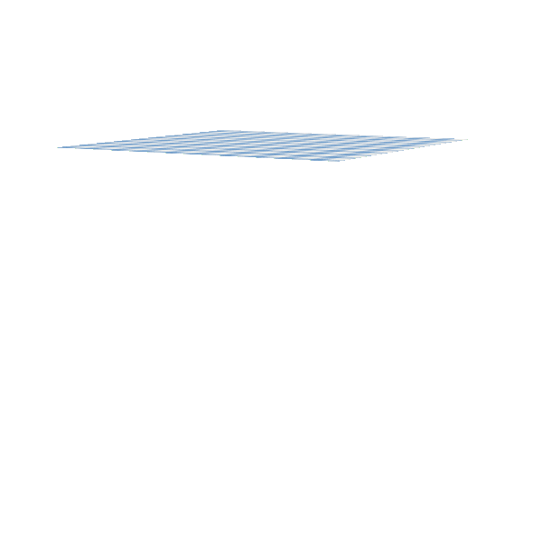

# Framework for inverse animation editing based on differentiable simulation
This is my Bachelor's thesis. The aim was to develop a tool for Unity which allowed the estimation of various simulation parameters within Unity.
It includes a differentiable physics engine built from scratch in C++, a Python module that does the optimizing using backpropagation to calculate the gradient of the loss function and a Unity project to display the results.

The objective of my thesis was to generate a simulation with some parameters for the mass and stiffness of a cloth and use numerical optimization combined with differentiable simulation and the backpropagation algorithm to guess those parameters based on the position of that simulation over many frames.

# Installation
Requires Python 3.10 (only version that works).

To install the engine module for Python:

    python -m pip install "/UnityDLL"
